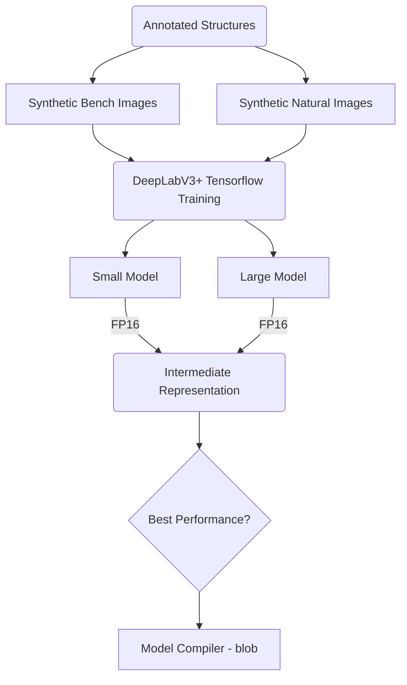

# CNN complete pipeline:

---

In this section you could find the next: 
1- DeepLabV3+ Modeling process
2- Model Opitmizer or Intermediate Representation Process
3- Script to measure the model performance in different instances.

---

For more details visit our [wiki](https://github.com/precision-sustainable-ag/OpenCV_Competition2021/wiki/6.-CNN-Model-Training) page 

